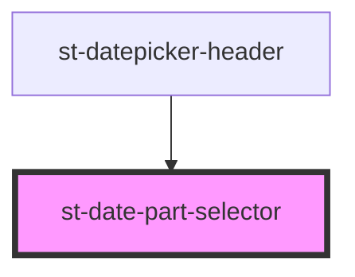

# st-date-part-selector

<!-- Auto Generated Below -->

## Properties

| Property       | Attribute | Description | Type                   | Default     |
| -------------- | --------- | ----------- | ---------------------- | ----------- |
| `dataSource`   | --        |             | `IDatePartModel[]`     | `undefined` |
| `date`         | --        |             | `Date`                 | `undefined` |
| `mode`         | `mode`    |             | `string`               | `undefined` |
| `onDateChange` | --        |             | `(date: Date) => void` | `undefined` |
| `show`         | `show`    |             | `boolean`              | `false`     |

## Dependencies

### Used by

 - [st-datepicker-header](../st-datepicker-header)

### Graph

----------------------------------------------

*Built with [StencilJS](https://stenciljs.com/)*
