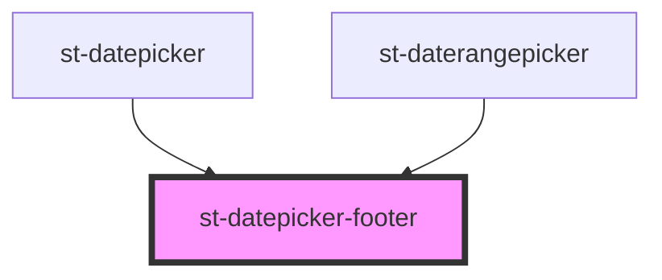

# st-datepicker-footer

<!-- Auto Generated Below -->

## Properties

| Property      | Attribute      | Description | Type         | Default     |
| ------------- | -------------- | ----------- | ------------ | ----------- |
| `cancelLabel` | `cancel-label` |             | `string`     | `undefined` |
| `okLabel`     | `ok-label`     |             | `string`     | `undefined` |
| `onApprove`   | --             |             | `() => void` | `undefined` |
| `onCancel`    | --             |             | `() => void` | `undefined` |

## Dependencies

### Used by

 - [st-datepicker](../../st-datepicker)
 - [st-daterangepicker](../../st-daterangepicker)

### Graph

----------------------------------------------

*Built with [StencilJS](https://stenciljs.com/)*
