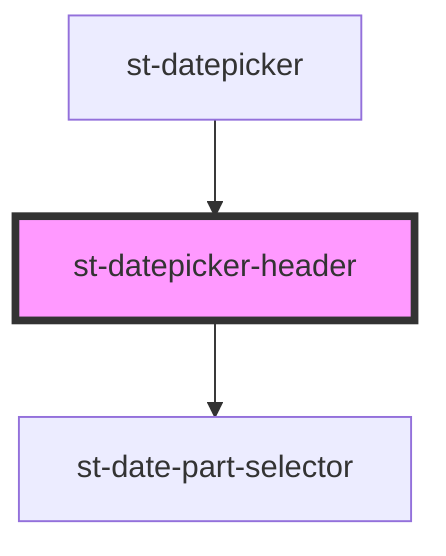

# st-datepicker-header

<!-- Auto Generated Below -->

## Properties

| Property       | Attribute   | Description | Type                   | Default     |
| -------------- | ----------- | ----------- | ---------------------- | ----------- |
| `currentDay`   | --          |             | `Date`                 | `undefined` |
| `onDateChange` | --          |             | `(date: Date) => void` | `undefined` |
| `yearFrom`     | `year-from` |             | `number`               | `undefined` |
| `yearTo`       | `year-to`   |             | `number`               | `undefined` |

## Dependencies

### Used by

 - [st-datepicker](../../st-datepicker)

### Depends on

- [st-date-part-selector](../st-date-part-selector)

### Graph

----------------------------------------------

*Built with [StencilJS](https://stenciljs.com/)*
