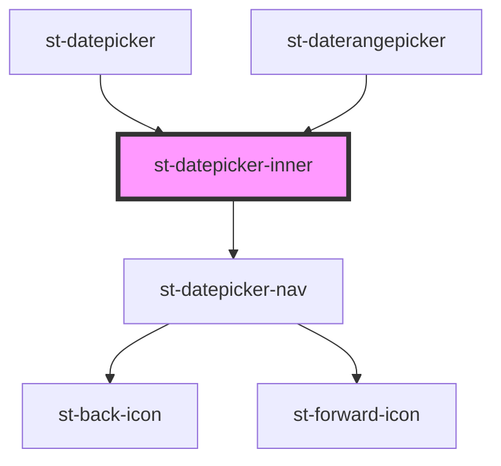

# st-datepicker-inner

<!-- Auto Generated Below -->

## Properties

| Property          | Attribute | Description | Type                                 | Default     |
| ----------------- | --------- | ----------- | ------------------------------------ | ----------- |
| `currentMonth`    | --        |             | `Date`                               | `undefined` |
| `datepickerDates` | --        |             | `IDatePickerModel[]`                 | `undefined` |
| `onDateSelect`    | --        |             | `(date: Date) => void`               | `undefined` |
| `onMonthChange`   | --        |             | `(date: Date) => void`               | `undefined` |
| `resolveDayView`  | --        |             | `(date: IDatePickerModel) => string` | `undefined` |

## Dependencies

### Used by

 - [st-datepicker](../../st-datepicker)
 - [st-daterangepicker](../../st-daterangepicker)

### Depends on

- [st-datepicker-nav](../st-datepicker-nav)

### Graph

----------------------------------------------

*Built with [StencilJS](https://stenciljs.com/)*
