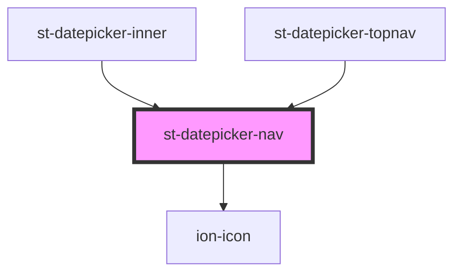

# st-datepicker-nav

<!-- Auto Generated Below -->

## Properties

| Property       | Attribute  | Description | Type                   | Default     |
| -------------- | ---------- | ----------- | ---------------------- | ----------- |
| `currentDate`  | --         |             | `Date`                 | `undefined` |
| `format`       | `format`   |             | `string`               | `undefined` |
| `navStep`      | `nav-step` |             | `string`               | `'d'`       |
| `onDateChange` | --         |             | `(date: Date) => void` | `undefined` |
| `toggleView`   | --         |             | `() => void`           | `undefined` |

## Dependencies

### Used by

 - [st-datepicker-inner](../st-datepicker-inner)
 - [st-datepicker-topnav](../st-datepicker-topnav)

### Depends on

- ion-icon

### Graph

----------------------------------------------

*Built with [StencilJS](https://stenciljs.com/)*
