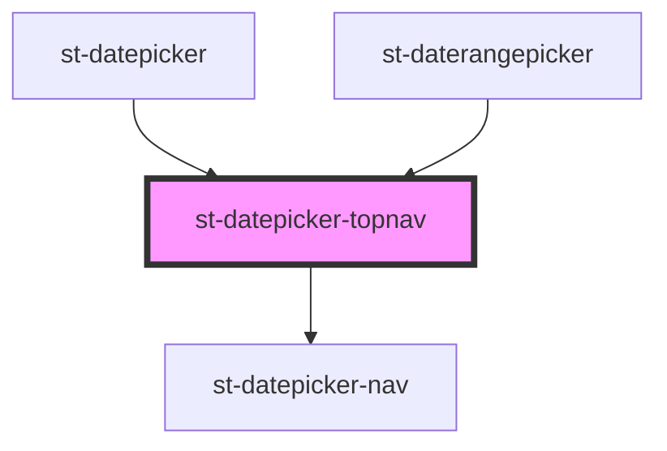

# st-datepicker-topnav

<!-- Auto Generated Below -->

## Properties

| Property       | Attribute | Description | Type                   | Default     |
| -------------- | --------- | ----------- | ---------------------- | ----------- |
| `date`         | --        |             | `Date`                 | `undefined` |
| `onDateChange` | --        |             | `(date: Date) => void` | `undefined` |
| `renderDate`   | --        |             | `() => void`           | `undefined` |
| `toggleView`   | --        |             | `() => void`           | `undefined` |

## Dependencies

### Used by

 - [st-datepicker](../../st-datepicker)
 - [st-daterangepicker](../../st-daterangepicker)

### Depends on

- [st-datepicker-nav](../st-datepicker-nav)

### Graph

----------------------------------------------

*Built with [StencilJS](https://stenciljs.com/)*
