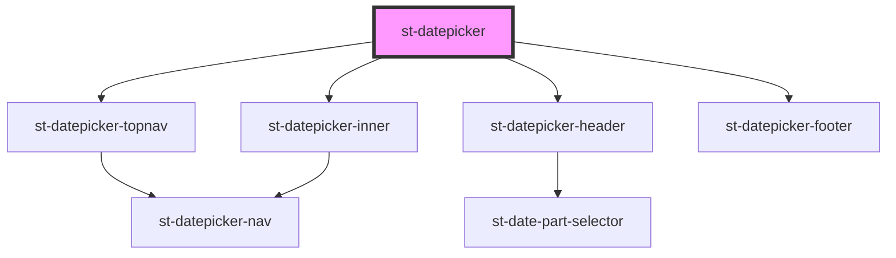

# st-datepicker

<!-- Auto Generated Below -->

## Properties

| Property       | Attribute      | Description | Type                   | Default     |
| -------------- | -------------- | ----------- | ---------------------- | ----------- |
| `cancelLabel`  | `cancel-label` |             | `string`               | `undefined` |
| `date`         | `date`         |             | `Date \| number`       | `undefined` |
| `from`         | `from`         |             | `number`               | `undefined` |
| `locale`       | `locale`       |             | `string`               | `undefined` |
| `okLabel`      | `ok-label`     |             | `string`               | `undefined` |
| `onDateChange` | --             |             | `(date: Date) => void` | `undefined` |
| `open`         | `open`         |             | `boolean`              | `undefined` |
| `to`           | `to`           |             | `number`               | `undefined` |

## Events

| Event         | Description | Type               |
| ------------- | ----------- | ------------------ |
| `dateChanged` |             | `CustomEvent<any>` |

## Methods

### `getDate() => Promise<Date>`

#### Returns

Type: `Promise<Date>`

## Dependencies

### Depends on

- [st-datepicker-topnav](../inner-components/st-datepicker-topnav)
- [st-datepicker-header](../inner-components/st-datepicker-header)
- [st-datepicker-inner](../inner-components/st-datepicker-inner)
- [st-datepicker-footer](../inner-components/st-datepicker-footer)

### Graph

----------------------------------------------

*Built with [StencilJS](https://stenciljs.com/)*
