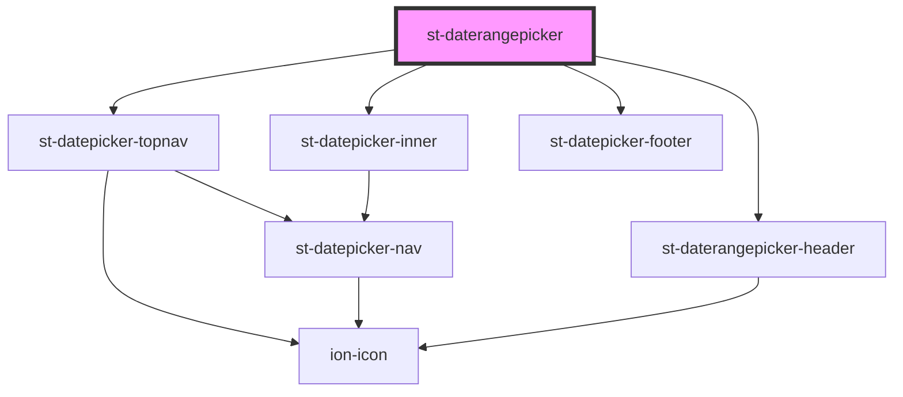

# st-daterangepicker

<!-- Auto Generated Below -->

## Properties

| Property    | Attribute | Description | Type      | Default     |
| ----------- | --------- | ----------- | --------- | ----------- |
| `dateEnd`   | --        |             | `Date`    | `undefined` |
| `dateStart` | --        |             | `Date`    | `undefined` |
| `open`      | `open`    |             | `boolean` | `undefined` |

## Events

| Event         | Description | Type               |
| ------------- | ----------- | ------------------ |
| `dateChanged` |             | `CustomEvent<any>` |

## Methods

### `getEndDate() => Promise<Date>`

#### Returns

Type: `Promise<Date>`

### `getStartDate() => Promise<Date>`

#### Returns

Type: `Promise<Date>`

## Dependencies

### Depends on

- [st-datepicker-topnav](../inner-components/st-datepicker-topnav)
- [st-daterangepicker-header](../inner-components/st-daterangepicker-header)
- [st-datepicker-inner](../inner-components/st-datepicker-inner)
- [st-datepicker-footer](../inner-components/st-datepicker-footer)

### Graph

----------------------------------------------

*Built with [StencilJS](https://stenciljs.com/)*
