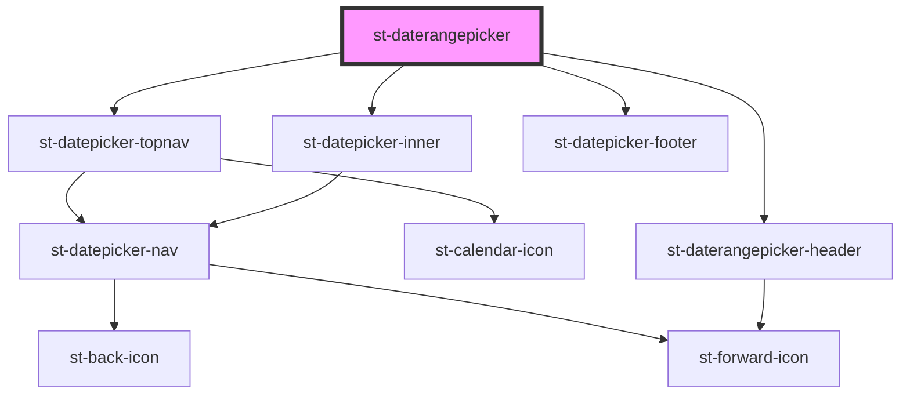

# st-daterangepicker

<!-- Auto Generated Below -->

## Properties

| Property       | Attribute      | Description | Type                               | Default     |
| -------------- | -------------- | ----------- | ---------------------------------- | ----------- |
| `cancelLabel`  | `cancel-label` |             | `string`                           | `undefined` |
| `dateEnd`      | `date-end`     |             | `Date \| number`                   | `undefined` |
| `dateStart`    | `date-start`   |             | `Date \| number`                   | `undefined` |
| `locale`       | `locale`       |             | `string`                           | `undefined` |
| `okLabel`      | `ok-label`     |             | `string`                           | `undefined` |
| `onDateChange` | --             |             | `(start: Date, end: Date) => void` | `undefined` |
| `open`         | `open`         |             | `boolean`                          | `undefined` |

## Events

| Event         | Description | Type               |
| ------------- | ----------- | ------------------ |
| `dateChanged` |             | `CustomEvent<any>` |

## Methods

### `getDateRange() => Promise<any>`

#### Returns

Type: `Promise<any>`

## Dependencies

### Depends on

- [st-datepicker-topnav](../inner-components/st-datepicker-topnav)
- [st-daterangepicker-header](../inner-components/st-daterangepicker-header)
- [st-datepicker-inner](../inner-components/st-datepicker-inner)
- [st-datepicker-footer](../inner-components/st-datepicker-footer)

### Graph

----------------------------------------------

*Built with [StencilJS](https://stenciljs.com/)*
